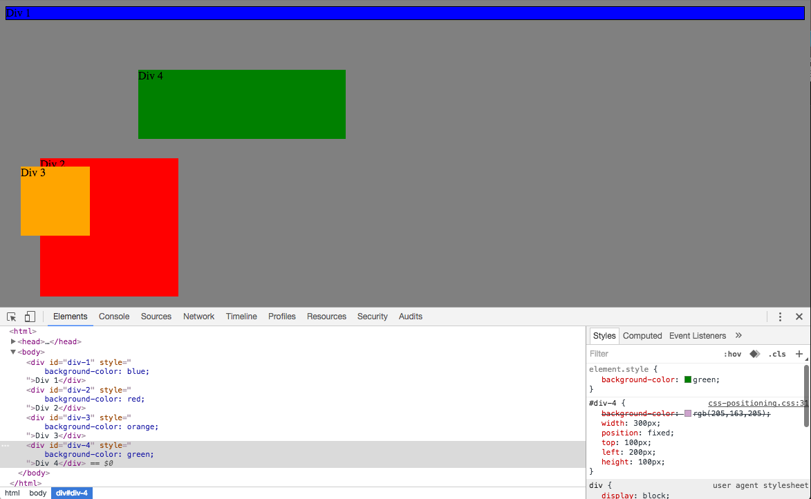
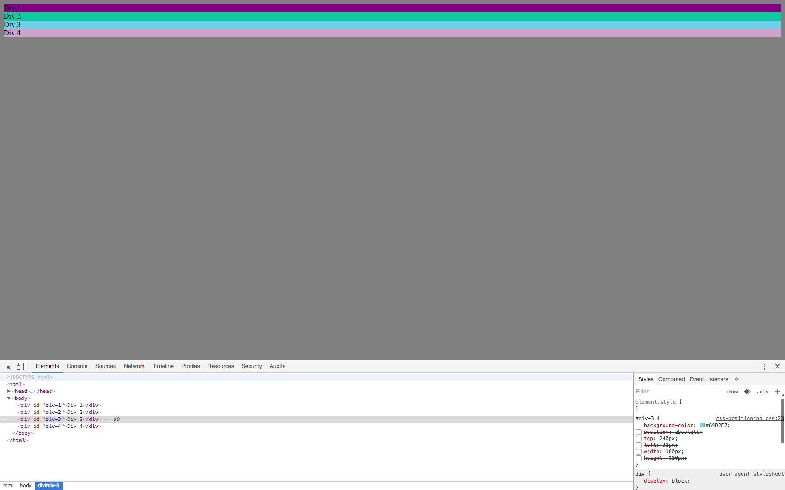
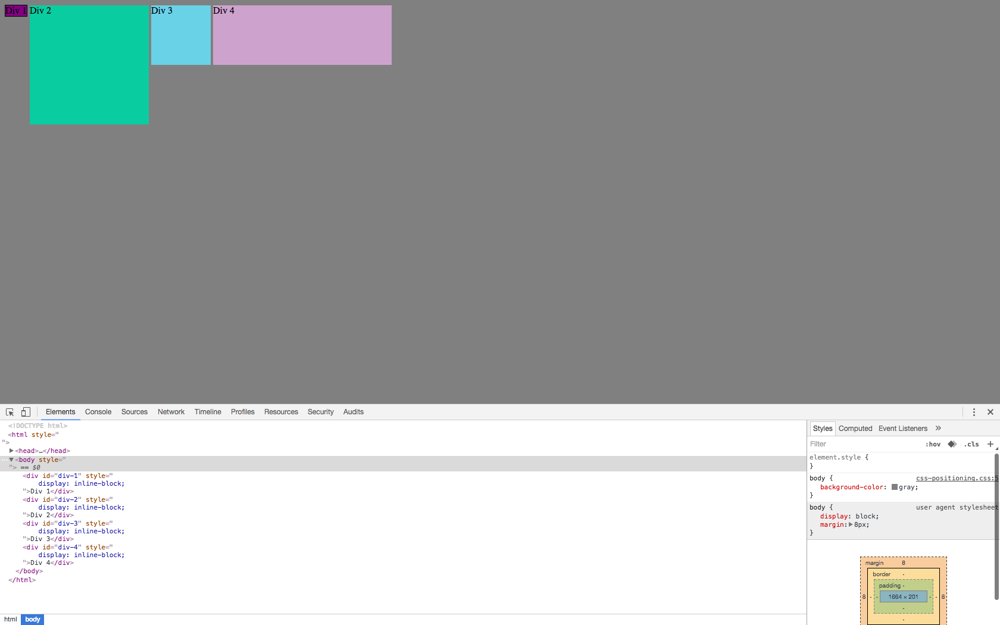
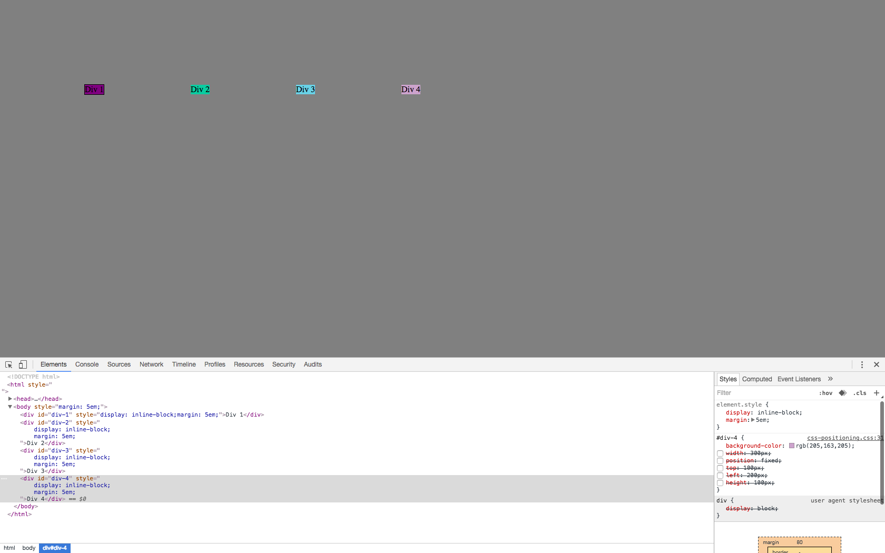
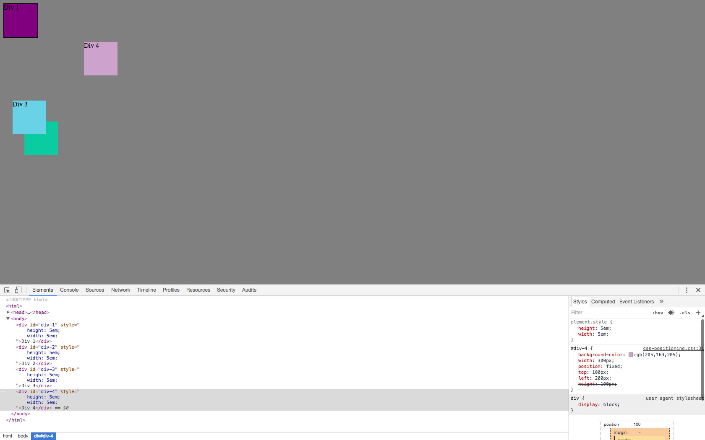
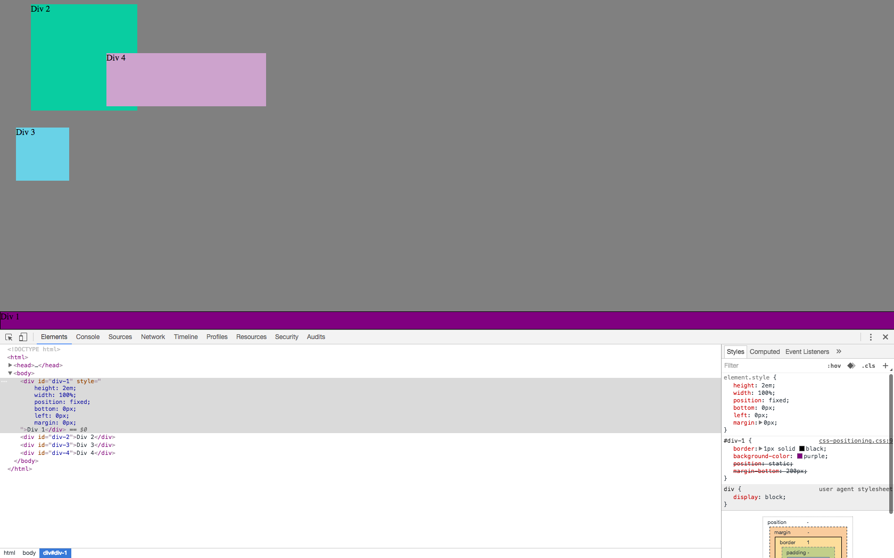
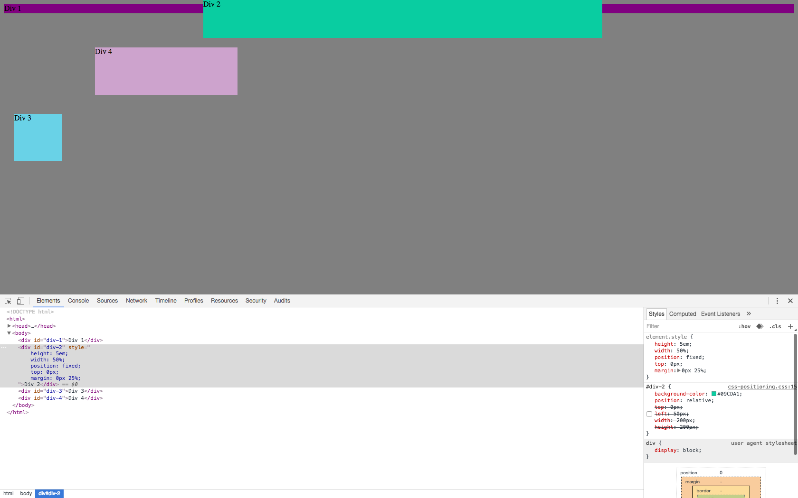
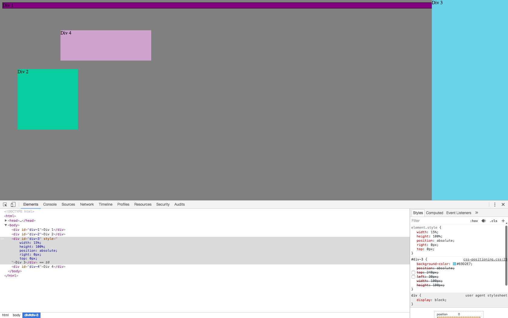
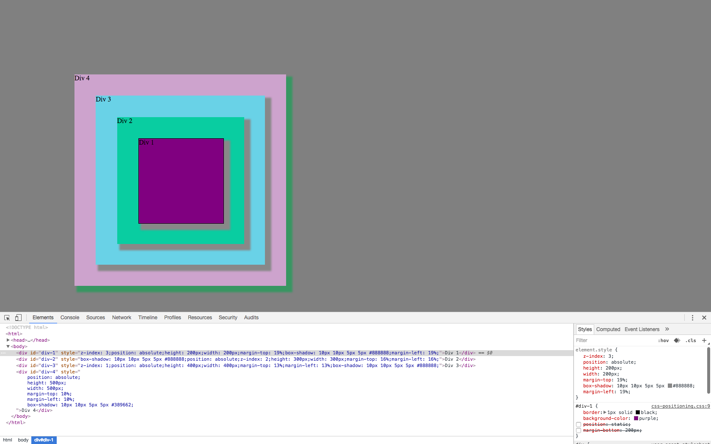

## How can you use Chrome's DevTools inspector to help you format or position elements?
####  Chrome Dev Tools lets you temporarily modify css in the browser to experiment with how changes will impact your site. This is helpfull because it allows you to make changes faster and less permenantly. 
##
## How can you resize elements on the DOM using CSS?
####  You can use "object {height:10px/%/em; width:10px/%/em;} where object is the element you want to modify.
##
## What are the differences between absolute, fixed, static, and relative positioning? Which did you find easiest to use? Which was most difficult?
####  An absolute element is uneffected by other elements on the page. Its location is specified as distance from the top left corner.
      A Fixed element is very similar only it will always remain in the same spot no matter how the page scrolls. 
      Static positioning is the default positioning, an object is placed following the object defined before. 
      A releative element is positioned in relation to other elements. 
      I found Fixed positioning to be the easiest to understand, although relative positioning feels like it will be the most useful. 
##
## What are the differences between margin, border, and padding?
####  Margin is the amount of space between an element and it's neighbors, padding is the amount of space between the content of an element and it's edges, and a border is the stroke around the outside of an element.
##
## What was your impression of this challenge overall? (love, hate, and why?)
#### I think it was good practice for something that were going to be doing alot of. A few times we got some unexpected behaivor from the CSS and had to do a little googling to resolve the problem but it was never too difficult to find the answer.

