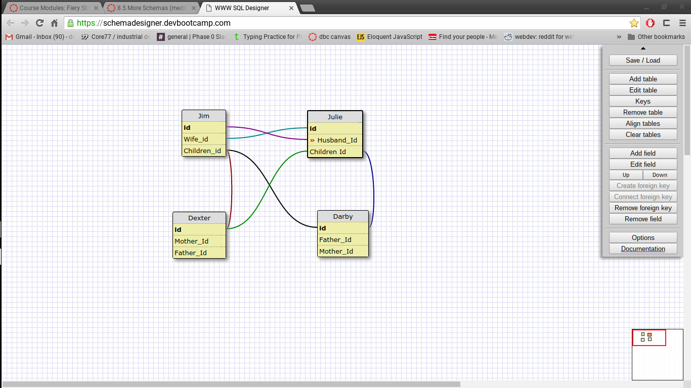
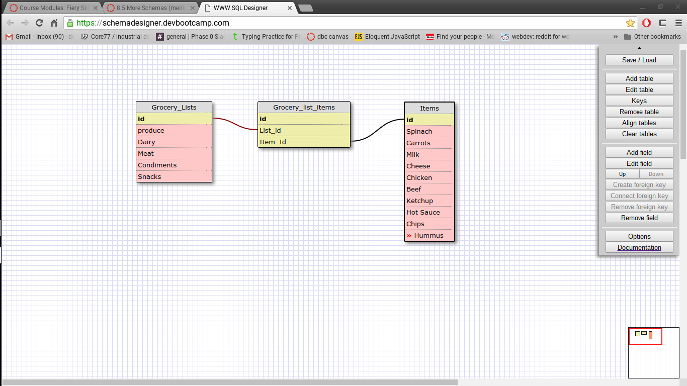

### What is a one-to-one database?
#### A one to one relationshio is when two items are unique ot one another, ie. a pair, yet could still exist without eachother. 
### When would you use a one-to-one database? (Think generally, not in terms of the example you created).
#### As answered above; When you have a pair of items that are not necessarily dependant on each other but are not related to anything else. 
### What is a many-to-many database?
#### A many to many relationship is when any specific item can be related to many different items which also have the potential to be related to many items
### When would you use a many-to-many database? (Think generally, not in terms of the example you created).
#### Anytime when you have many objects with multiple relateions. 
### What is confusing about database schemas? What makes sense?
#### I feel that i understand them fairly well although they are challenging to talk about well, they feel like a very show-don't-tell kinda thing. 

#### This schema illustrates a one to one relationship between a husband and a wife (in a conventional family). 

#### This schema illustrates a many to many relationship through a grocery list and the items it may relate to. 
