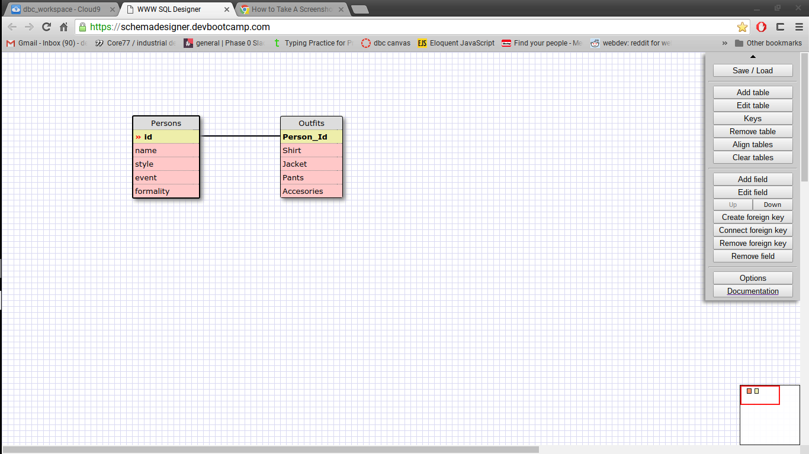

### Select data from all of the states 
#### select * from states; 
###
### select all data for all regions
#### select * from regions; 
###
### select the state_name and population for all states
#### select state_name,population from states;
###
### select the state_name and population for all states ordered by population
#### select state_name,population from states order by population desc;
###
### select state_name for all the states in reigion 7 
#### select state_name from states where region_id == 7;
###
### Select the state_name and population_density for states with a population density over 50 ordered from least to most dense.
#### select state_name,population from states where population_density > 50 order by population_density asc;
###
### Select the state_name for states with a population between 1 million and 1.5 million people.
#### select state_name from states where population > 1000000 and population < 1500000;
###
### Select the state_name and region_id for states ordered by region in ascending order.
#### select state_name,region_id from states order by region_id asc;
###
### Select the region_name for the regions with "Central" in the name.
#### select region_name from regions where region_name like '%Central';
###
### Select the region_name and the state_name for all states and regions in ascending order by region_id. 
### Refer to the region by name. (This will involve joining the tables).
#### select region_name,state_name from states join regions on regions.id=states.region_id order by region_id asc;  
###
###

###
### What are databases for?
#### They are a means for storing data. They are easily secure, easily queried, and organized means of storing data. 
### What is a one-to-many relationship?
#### It is a relationship between one row and many others. Ie. a Person_id could be related to may different rows in the Outfit table. 
### What is a primary key? What is a foreign key? How can you determine which is which?
#### A primary key is a field that uniquely identifies a row. A foreign key is one used to connect two tables. A foreign key does not need to be unique to it's row. 
### How can you select information out of a SQL database? What are some general guidelines for that?
#### you specify the data you want to select, where you want to select it from and what sorting parameters you want. 

